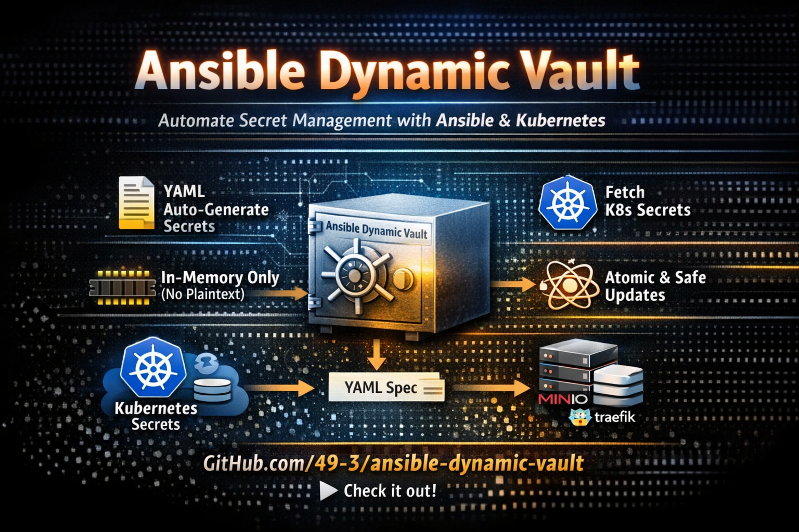

# 🔐 Ansible Dynamic Vault



⭐ **Recruiter? Start here → [RECRUITER_README.md](RECRUITER_README.md)**

📚 **Detailed usage examples → [README_DETAILED.md](README_DETAILED.md)**

Production-grade secret lifecycle automation for Ansible Vault.
Dynamic generation, external secret integration, and atomic persistence — without external secret managers.

---

## 🚀 Why This Project Exists

Native Ansible Vault encrypts secrets, but it does not manage their lifecycle.

This project adds:

- Automatic secret generation
- Safe updates
- External secret imports (e.g., Kubernetes)
- Atomic encrypted persistence
- Zero plaintext exposure on disk

---

## ⚙️ Features

- 🔐 Memory-only secret handling (tmpfs)
- ♻️ Idempotent secret generation
- ☸️ Kubernetes secret import
- 🧱 Atomic encrypted writes with locking
- 📦 Git-auditable encrypted state
- 🧩 Modular Ansible roles

---

## 🏗 Architecture

Three composable roles:

### vault_loader
Decrypts and loads the vault into memory.

### vault_autogen
Generates missing secrets from declarative spec.

### vault_mutator
Persists the updated vault atomically and safely.

---

## ▶️ Usage Examples

### Generate missing secrets automatically

```bash
ansible-playbook ansible/playbooks/vault_mutator_autogen_test.yml
```

Generates secrets defined in the specification if absent from the vault.

---

### Import secrets from Kubernetes

```bash
ansible-playbook ansible/playbooks/vault_k8s_import.yml
```

Retrieves secrets using kubectl, merges them into the vault, and encrypts atomically.

---

### Use secrets in deployments

```yaml
vars:
  minio_root_user: "{{ vault_minio_root_user }}"
  minio_root_password: "{{ vault_minio_root_password }}"
```

Secrets are injected at runtime without exposing plaintext.

---

### Declare secrets to generate

```yaml
vault_autogen_spec:
  minio_root_user:
    type: password
    length: 20

  minio_root_password:
    type: password
    length: 40
```

Declarative secret specification enables idempotent generation.

---

## 🔐 Security Model

- No plaintext on persistent storage
- Atomic file replacement
- POSIX file locking
- Automatic cleanup of sensitive data

---

## 📈 Ideal Use Cases

- Kubernetes deployments
- CI/CD pipelines
- Self-hosted infrastructure
- Air-gapped environments

---

## 🤝 Contributing

See [CONTRIBUTING.md](CONTRIBUTING.md)

---

## 📜 License

see [LICENSE](LICENSE)
